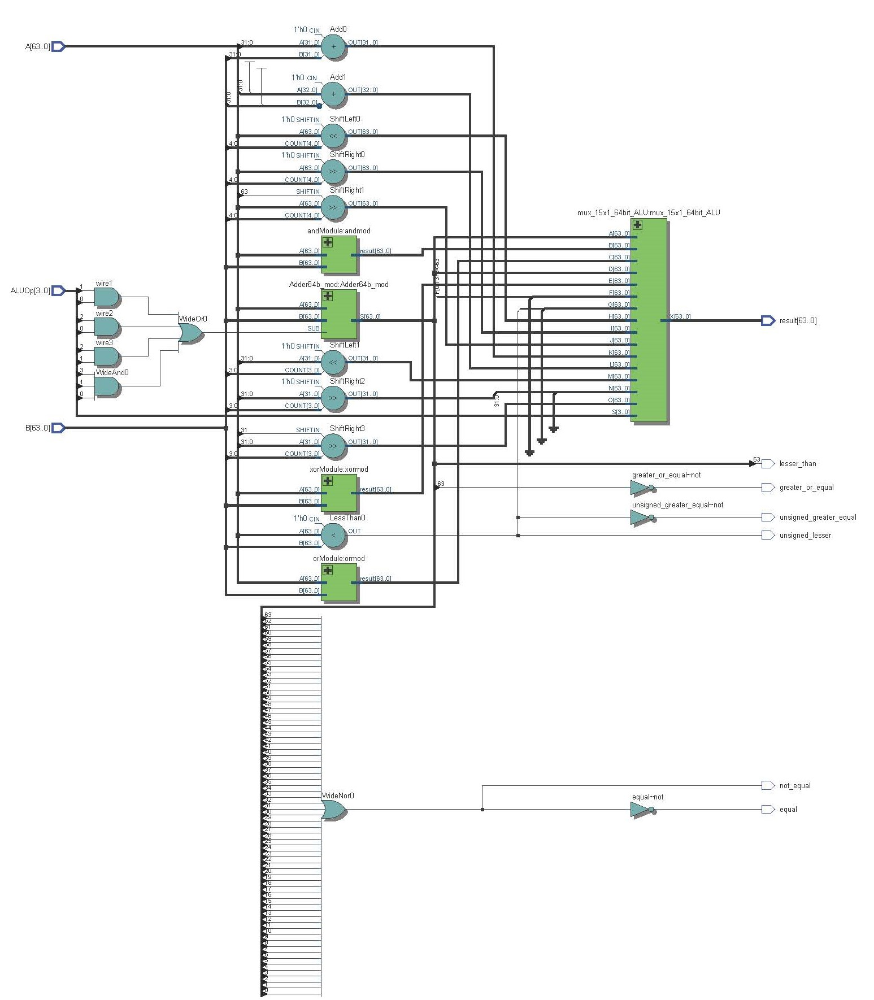

# ALU 
A Unidade Lógica e Aritmética é um componente chave responsável por realizar operações aritméticas e lógicas, além de operações lógicas. É um bloco de construção fundamental do pipeline de execução do processador. A ALU recebe operandos de entrada, e executa várias operações neles, com base na instrução fornecida pela ALU Control. A nossa ALU suporta uma ampla gama de operações, listadas mais abaixo.

### Funcionamento geral da ALU:
1. Operações aritméticas: operações aritméticas básicas como adição e subtração de valores inteiros. 
2. Operações Lógicas: operações lógicas, como AND, OR, XOR e deslocamento de bits.
3. Operações de comparação: compara dois valores e determina sua relação, como igualdade, maior que, menor que, etc. 
4. Manipulação de dados: executa operações de manipulação de dados, incluindo deslocamento de bits para a esquerda ou direita.
5. Sinais de controle: recebe sinais de controle da ALU Control, que a instrui sobre qual operação realizar e como interpretar os operandos de entrada.

- [X] ADD
- [X] SUB 
- [X] OR 
- [X] AND 
- [X] XOR 
- [X] SET LESS THAN 
- [X] SET LESS THAN UNSIGNED 
- [X] SHIFT LEFT LOGICAL
- [X] SHIFT RIGHT LOGICAL
- [X] SHIFT RIGHT ARITHMETIC
- [X] ADD WORD
- [X] SUB WORD
- [X] SHIFT LEFT LOGICAL WORD
- [X] SHIFT RIGHT LOGICAL WORD
- [X] SHIFT RIGHT ARITHMETIC WORD

#### Abaixo é possível visualizar o circuito sintetizado da ALU:

