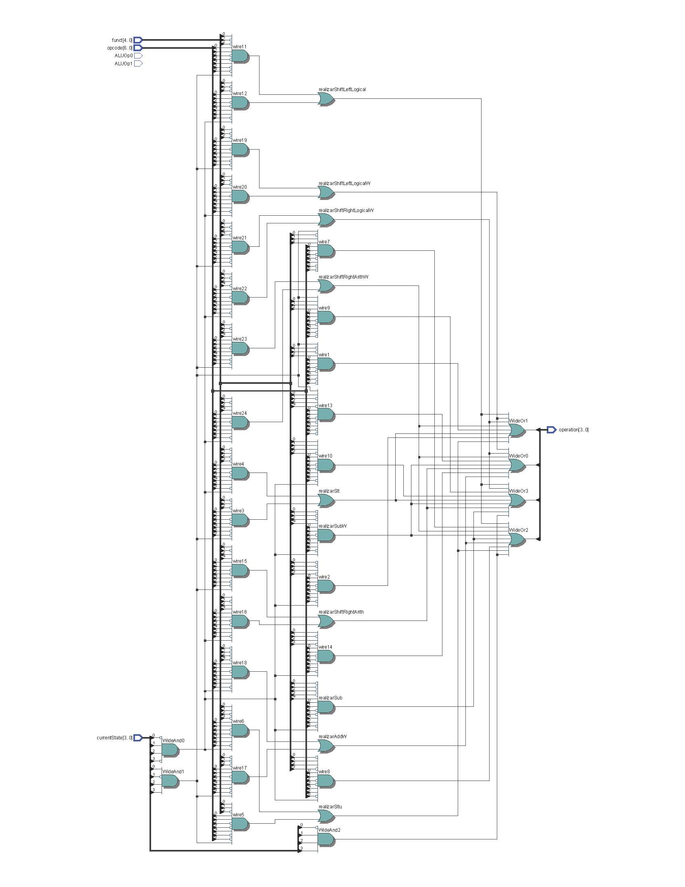

# ALU Control

O módulo ALU Control é responsável por gerar sinais de controle que determinam a operação específica a ser realizada pela ALU. O módulo de controle da ALU recebe informações como o funct e opcode de uma instrução e gera os sinais necessários para configurar a ALU para a operação desejada.

### Funcionamento geral da ALU Control:
1. Decodificação da Instrução: recebe o opcode e funct da instrução que contêm informações sobre a operação a ser executada pela ALU.
2. Seleção da função da ALU: determina o tipo de operação a ser executada.
3. Saída do sinal de controle:  gera o ALUOp que será enviado para a ALU

### Operacoes:
- 0000: ADD
- 0001: AND
- 0010: OR
- 0011: SUB
- 0100: XOR
- 0101: SET LESS THAN
- 0110: SET LESS THAN IMMEDIATE UNSIGNED
- 0111: SHIFT LEFT LOGICAL
- 1000: SHIFT RIGHT LOGICAL 
- 1001: SHIFT RIGHT ARITHMETICAL
- 1010: ADD WORD
- 1011: SUB WORD
- 1100: SHIFT LEFT LOGICAL WORD
- 1101: SHIFT RIGHT LOGICAL WORD
- 1110: SHIFT RIGHT ARITHMETIC WORD

#### O circuito sintetizado da ALU Control está disponível abaixo:

