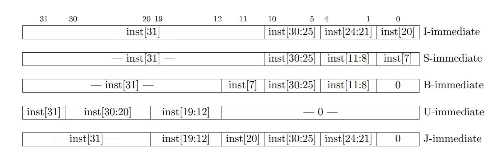

# Immediate Generator

O Immediate Generator tem como função, juntar determinados bits da instrução, a depender da Operation Code. Observe a estrutura das instruções, o immediate (imm), que é um número de entrada, é retirado dos 32 bits de instruções e setado como output com sinal e em 64 bits.

| Immediate typo U |||
|: [31:12] :|: [11:7] :|: [6:0] :|
|-----|-----|-----|
| immediate | X | X |

Abaixo, o circuito sintetizado do Immediate Generator:

