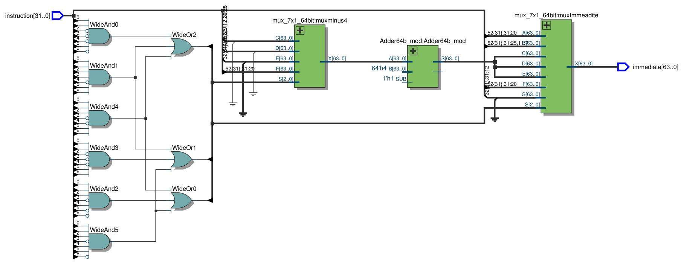

# Immediate Generator

O Immediate Generator tem como função, juntar determinados bits da instrução, a depender da Operation Code. Observe a estrutura das instruções, o immediate (imm), que é um número de entrada, é retirado dos 32 bits de instruções e setado como output com sinal e em 64 bits.

1. Decodificação da Instrução: recebe a instrução que está sendo executada e extrai o campo imediato da instrução.
2. Geração do Immediate: gera o immediate a depender da instrução passada, em complemento de 2.
3. Geração de Operando: o valor do immediate gerado é então utilizado como operando em operações aritméticas ou lógicas.

#### Diferentes tipos de immediate para cada instrução

#### Abaixo, o circuito sintetizado do Immediate Generator:

