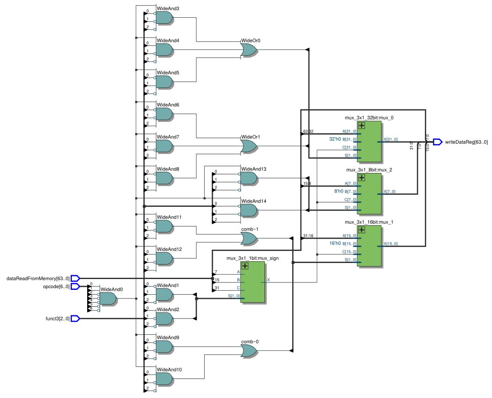
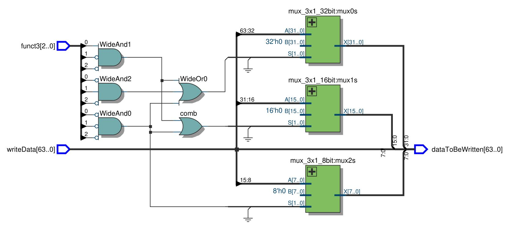

# Load e Store
Os módulos load_choose.v e storage_choose.v são responsáveis por filtrar a palavra que vai ser escrita na memória dependendo do tipo de instrução.
 
#### Circuito sintetizado do load_choose:

#### Circuito sintetizado do storage_choose:

