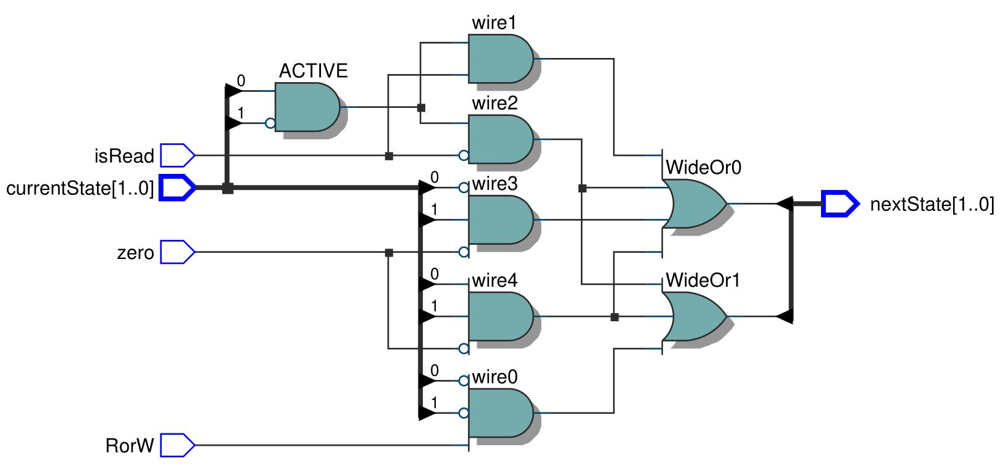
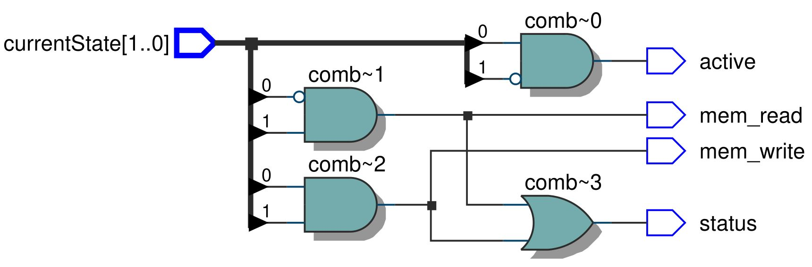

# Memory Controller

O Memory Control é responsável por gerenciar a comunicação entre o processador e a memória. Ele lida com a coordenação e controle das operações de memória, como solicitações de leitura e gravação de plavras de diferentes tamanhos, como byte, half-word, word e double word.

Os módulos load_choose.v e storage_choose.v são responsáveis por filtrar a palavra que vai ser escrita na memória dependendo do tipo de instrução.

### Abaixo estão imagens dos circutios sintetizados que fazer parte do Memory Controller

#### Circuito sintetizado do MCNextState:

#### Circuito sintetizado do MCOutput:

#### Circuito sintetizado do MemoryController:

<!-- #### Circuito sintetizado do load_choose:

#### Circuito sintetizado do storage_choose:
 -->
