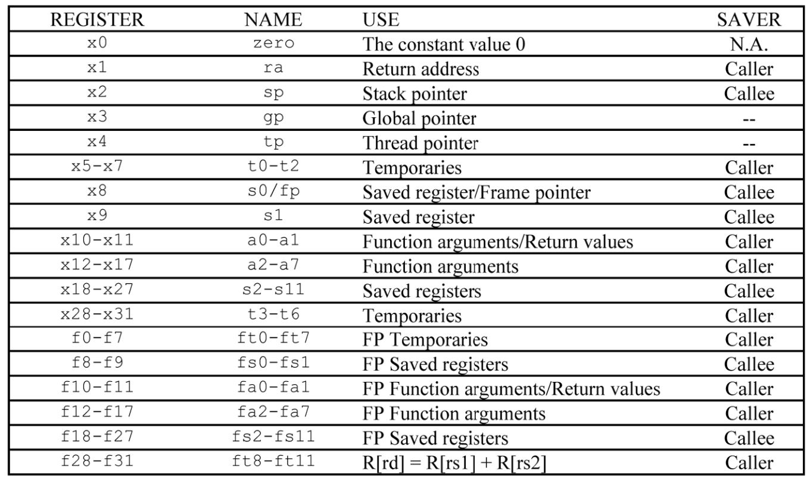
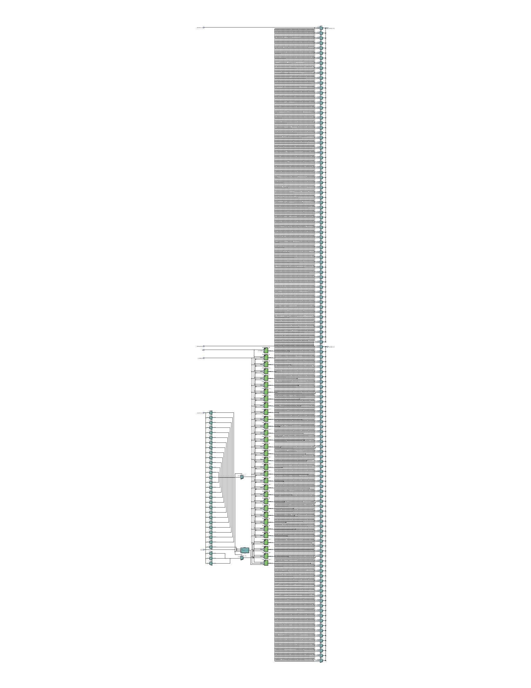

### Registers 
Os registradores são pequenos locais de memória de alta velocidade que armazenam dados ou instruções sendo processadas pelo processador. O módulo Registers fornece armazenamento para vários tipos de dados usados durante a execução da instrução.

Nosso processador também conta com um banco de 32 registrador previstos pela arquitetura da ISA do RISC-V que são responsáveis por diversas funções dependendo do tipo de instrução que está sendo executada. Uma visão mais detalhada do papel de cada registrador do banco de registrador do RISC-V pode ser vista abaixo. Lembrando que a papel de cada registrador, como visto abaixo, é apenas uma convenção e não é necessáriamente um requisito para o funcionamento do processador.

#### Função de cada registrador de acordo com a ISA do RISC-V

### Funcinamento geral de um registrador
1. Armazenamento de Dados: o registrador serve como armazenamento primário para operandos de dados usados em operações aritméticas, lógicas e de manipulação de dados. 
2. Acesso ao Operando: As unidades de execução do processador, como a Unidade Lógica Aritmética (ALU), podem acessar diretamente o regitrador para recuperar os operandos de entrada e armazenar os resultados dos cálculos.

#### Abaixo, o circuito sintetizado do Immediate Generator:
