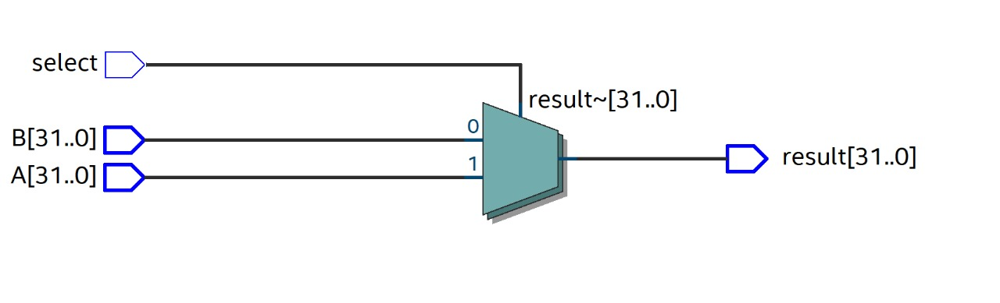

# Multiplexador (MUX)
O Mux é responsável por selecionar um sinal de entrada específico para sua saída com base nos sinais de controle. O Mux atua como um switch digital, permitindo que diferentes fontes de entrada sejam conectadas seletivamente à saída.

### funcionamento geral de um MUX
1. Seleção de entrada: o MUX possui várias portas de entrada, cada uma recebendo um sinal de entrada diferente.
2. Entrada de Sinal de Controle: recebe um ou mais sinais de controle que determinam qual sinal de entrada deve ser selecionado e roteado para a saída.
3. Saída: Com base nos sinais de controle, o módulo Mux roteia o sinal de entrada selecionado para a porta de saída.

### Circuito sintetizado de um MUX 2x1 de 32 bits

